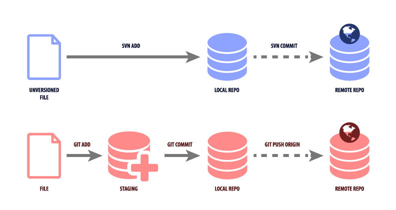

Git Basics
==========

This repo contains the comparison between SVN vs Git Workflow and basic Git Commands.<br/>
You can see the slides at [Git Basic](http://nciinc.github.io/git/)

# Content

- SVN / Git Workflow
- Cheat Sheet
- Get Repo from Remote to Local
- Git Configure Author
- Get latest from Remote to Local
- Add/Ignore Files/Folders
- Undo Add (Reset)
- Commit && Push to Local/Remote Repo
- Undo Commit (hard reset)
- Create/Switch/List/Merge Branch
- Rename/Remove Files/Folder
- Git STATUS
- Best Practices - Folders/Branches/Deployment
- Common Mistakes
- Conflicts

# SVN / Git Workflow



# Cheat Sheet

DO-DA-HARD-WORK<br/>
Get ready to Commit<br/>
```bash
$ git pull origin /branch/       # Get Latest
```

CHECK CONFLICTS<br/>

```bash
$ git add . -f                   # Add/Rename/Remove All
$ git commit -m "changes"        # Commit to Local
$ git push -u origin /branch/    # Push to Remote
```

# Get Repo from Remote to Local

SVN
```bash
$ svn checkout /url/
```

GIT
```bash
$ git clone /url/
```

# Git Configure Author

GIT set user name to repo only or globally
```bash
$ git config user.name "John Doe"
$ git config --global user.name "John Doe"
```

GIT set email to repo only or globally
```bash
$ git config user.email "hi@ivandj.im"
$ git config --global user.email "hi@ivandj.im"
```

# Get latest from Remote to Local

SVN
```bash
$ svn checkout /url/
```

GIT (will merge with local changes)
```bash
$ git pull origin /branch/
```

# Add Unversioned Files

SVN
```bash
$ svn add /filename/
```

GIT
```bash
$ git add /filename/
```

GIT add all files
```bash
$ git add .
```

# Add to Staging (Git)

```bash
$ git add /filename/
```

Add all files/folders
```bash
$ git add .
```

Add all changes/renames/removes (force)
```bash
$ git add . -f
```

# Undo Add (reset)

SVN
```bash
$ svn revert
```

GIT
```bash
$ git reset /filename/
```

GIT revert all files/folders
```bash
$ git reset
```

# Ignore Files

SVN
```bash
$ svn propedit svn:ignore /folder name/
```

GIT - create file ".gitignore"<br/>
add file/folder names each on seperate line<br/>
useful for configs, settings, anything that doesn't need to go to repo.


# Commit

SVN commits to Local AND Remote
```bash
$ svn commit -m "changes" /filename/
```

GIT commit to Local Repo (only)
```bash
$ git commit -m "changes"
```

# Revert to Previous Commit

SVN
```bash
$ svn revert
```

GIT
```bash
$ git reset --hard /commit-sha/
```

GIT Reverting a merge commit
```bash
$ git revert -m 1 /merge_sha/
```

# Push to Remote

SVN
<br/>

GIT
```bash
$ git push -u origin /branch/
```

# List Branches Git

GIT branch - see current
```
$ git branch
```

GIT list local AND remote (all)
```bash
$ git branch -a
```

GIT list remote
```bash
$ git branch -r
```

# Create a Branch

SVN
```bash
$ svn copy /repo-url/trunk /repo-url/branches/new-branch -m "Creating a branch of /trunk."
$ svn checkout /new-branch-url/
```

GIT branch from current
```
$ git checkout -b /new-branch/
```

GIT branch empty
```bash
$ git checkout --orphan /new-branch/
```

GIT: if you created a branch in your local, you need to push to remote
```bash
$ git push -u origin /new-branch/
```

GIT: if you created a branch in your remote, you need to pull to local
```bash
$ git pull origin /new-branch/
```

# Switch Branch

SVN
```bash
$ svn checkout /new-branch-url/
```

GIT
```bash
$ git pull origin # get latest
$ git checkout /new-branch/
```


# Merge Branch

SVN
```bash
$ svn merge /master-branch-url/
```

GIT merge branch1 to master
```bash
$ git pull origin # get latest
$ git checkout branch1
```

make changes, commit to branch1<br/><br/>

GIT switch to master
```bash
$ git checkout master
```

merge
```bash
$ git merge branch1
```

# Rename

SVN<br/>
go to Repo Browser<br/>
Rename the file<br/>
Checkout<br/>

GIT - rename file in local, commit, push
```bash
$ git add -f /filename/
$ git commit -m "I have renamed da file"
$ git push -u origin /branch/
```

# Remove

SVN<br/>
go to Repo Browser<br/>
Remove the file<br/>
Checkout<br/>

GIT - remove file in local, commit, push
```bash
$ git add -f /filename/
$ git commit -m "I have renamed da file"
$ git push -u origin /branch/
```

# Git Status

- Your new best friend
- Where are your files?
- What's going on?

# Best Practice - Folders

- db
- docs
    - sprints/stories
    - release notes
- front-end
- back-end
- test


# Best Practice - Branches/Features

- sprint1-story01-feature01-mockups
- s1-st01-f02-name
- s1-st02-f01-name
- s2-st01-f01-name
- s2-st01-f02-name
- deploy-dev
- deploy-st
- deploy-at
- deploy-live

# Best Practice - Deployment

**1 Commit 1 Release** <br/>
- deploy-dev
- deploy-st
- deploy-at
- deploy-live

CI hook to Branch Commit

# Common Mistakes

1. SVN: commit without checkout 1st
2. GIT: commit without pull origin 1st

# Conflicts

1. Make a copy of YOUR FILES
2. CLONE Fresh copy from remote
3. APPLY your changes
4. COMMIT && PUSH


